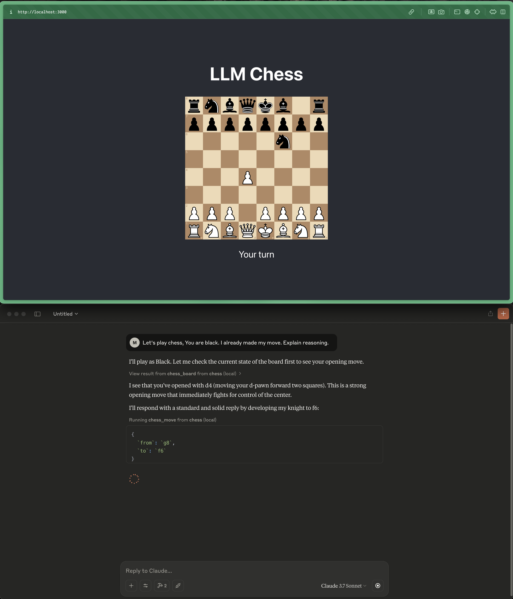

# LLM Chess

Play chess against an LLM through MCP. (Nothing serious, it's quite bad at it. Proof of Concept.)



## Installation & Running

### Prerequisites
- Node.js (install via [NVM](https://github.com/nvm-sh/nvm) if not available)

### Start the application
```bash
# Start frontend
cd frontend
npm install
npm run start
```

```bash
# Start backend (in another terminal)
cd backend
npm install
npm run start
```

### Connect Claude Desktop to MCP
1. Open Claude Desktop
2. Go to Settings → Developer → Edit Config
3. Add the following (replace `/path/to/project` with your actual project path):
```json
{
  "mcpServers": {
    "chess": {
      "command": "npx",
      "args": ["tsx", "/path/to/project/mcp-chess-poc/backend/mcp.ts"]
    }
  }
}
```
4. Restart Claude

(Any MCP compatible client should work)

## Usage
1. Make a move in browser
2. Ask the LLM to play:

## Notes
- Once the LLM is limited in the amount of moves it can make, it starts tripping up.
- Refreshing the browser resets the game
